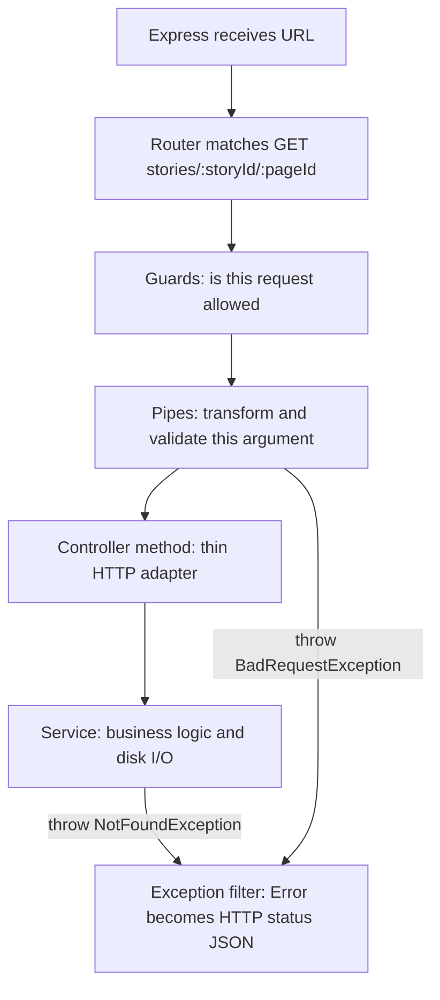

# Path traversal: options and NestJS primitives

> Historical notes from the hardening discussion (August 2026).
>
> **Status: Option C, applied and wired (31 Aug 2026).** `ValidationPipe` + param DTOs in
> [`src/story.params.ts`](../src/story.params.ts) and [`src/configure-app.ts`](../src/configure-app.ts);
> disk checks in [`src/story.paths.ts`](../src/story.paths.ts).
>
> **Which layer is the security boundary:** [`src/story.paths.ts`](../src/story.paths.ts), called by
> [`src/app.service.ts`](../src/app.service.ts). It validates its own inputs, so it holds no matter
> how the service is invoked. The DTO layer is defense-in-depth plus better status codes
> (400 for a malformed slug instead of 404) — remove it and the app is still safe; remove
> `story.paths.ts` and it is not.
>
> ⚠️ **Note for readers of earlier revisions.** This document previously claimed Option C was
> applied when it was not: the modules existed but nothing imported them, `main.ts` never
> called `configureApp()`, the controller still took raw string params, and
> `class-validator` / `class-transformer` were missing from `package.json`. The live app
> served `GET /stories/richard/..%2F..%2FREADME` as **200 with the full README**. That gap
> was found by an audit on 30 Aug 2026 and closed on 31 Aug 2026.

**Chosen path: C** — global `ValidationPipe` + param DTOs. Learning Nest is the point of the repo, so we use the framework’s usual validation style instead of a custom slug pipe.

---

## What we will change when you say implement (C)

Use Nest’s stock pipeline (`ValidationPipe` + DTOs) for shape validation. Keep [`src/story.paths.ts`](../src/story.paths.ts) for `resolve` / `realpath` / inside-`stories/` (that is not a Nest feature).

1. Add `class-validator` and `class-transformer` (Nest’s `ValidationPipe` expects them).
2. In [`src/main.ts`](src/main.ts):

```ts
app.useGlobalPipes(
  new ValidationPipe({
    whitelist: true,
    forbidNonWhitelisted: true,
    transform: true,
  }),
);
```

- `transform: true` — turn the raw param object into an instance of the DTO class so decorators run.
- `whitelist` / `forbidNonWhitelisted` — ignore or reject unexpected fields (more useful later for JSON bodies).

3. New DTO(s), e.g. [`src/story-page.params.ts`](src/story-page.params.ts):

```ts
export class StoryIdParams {
  @Matches(/^[a-z0-9][a-z0-9-]{0,63}$/)
  storyId: string;
}

export class StoryPageParams extends StoryIdParams {
  @Matches(/^[a-z0-9][a-z0-9-]{0,63}$/)
  pageId: string;
}
```

4. Controller: `@Param('storyId', ParseStorySlugPipe)` becomes `@Param() params: StoryPageParams` (and `StoryIdParams` on the start route). Call `this.appService.getStoryPage(params.storyId, params.pageId)`.
5. Delete the custom pipe. Keep `isStorySlug` in the service for **`meta.json`’s `start` field** — that string never goes through `ValidationPipe`.
6. Tests: illegal slugs (`a-new-job.md`) become **400** (ValidationPipe default). Missing well-formed pages stay **404**.

Background below is the decision record. Option C is what shipped.

---

## NestJS 101: what happens on `GET /stories/richard/a-new-job`

Your app is a Nest wrapper around Express. Nest splits “handle this HTTP request” into a **pipeline**. Each piece has a job; putting security in the wrong piece still works, but you fight the framework later.



**Controller** ([`src/app.controller.ts`](src/app.controller.ts)) is the **route table**: URL shape, Swagger docs, which service method to call. It should stay thin. It does not own “is this a safe filename?”

**Service** ([`src/app.service.ts`](src/app.service.ts)) is the **use-case**. Anything that reads disk belongs here (or a helper it calls). If a test, a future CLI, or another controller calls `getStoryPage`, those callers **skip pipes and guards**. That is why filesystem containment cannot live *only* on the HTTP layer.

**Pipe** (`PipeTransform`) runs **per parameter** after the route matched. Nest’s `ParseIntPipe` / `ParseUUIDPipe` are this: “this `:id` must be an int / UUID, or fail.” A custom `ParseStorySlugPipe` is the same idea for kebab-case ids. Pipes **do not** see the whole request unless you write an awkward one; they are for “this string in, this typed value out.”

**Guard** (`CanActivate`) answers **yes/no**: logged in? admin? They run **before** pipes. They are for authorization, not “parse this slug.” You *could* regex params in a guard; you then duplicate logic and still need the service to refuse bad paths. Skip guards for this problem.

**`ValidationPipe` + DTO class** is Nest’s “incoming data is an object with decorators” style. You declare `class StoryPageParams { @Matches(...) storyId: string }`, then `@Param() params: StoryPageParams`. Nest maps route params onto that class and runs `class-validator`. That needs two extra packages (`class-validator`, `class-transformer` — now in `dependencies`). Failures default to **400** with a validation error body. It shines when you also validate JSON bodies later; it is heavier for two URL segments.

**Exceptions** (`NotFoundException`, `BadRequestException`): if the service or pipe **throws** these, Nest’s default filter turns them into HTTP 404/400 JSON. If the service **returns a string** like `"Error reading file"` (old code), Express sends **200**. Callers and caches cannot tell success from failure. For security, missing/illegal pages should not look like a successful markdown payload.

**`OnModuleInit`**: a hook Nest calls once when the module starts. Option D uses it to scan `stories/` into a Map so request handling never builds a path from user input.

---

## Question 1 — Where should the checks live?

You asked for two kinds of check. They are **not the same layer**:

1. **Shape** (regex): “does this string look like a story/page id?” Cheap, no disk. Fits a **pipe** or DTO.
2. **Real file inside `stories/`**: `resolve` + `realpathSync` + “still under the stories root.” Must run **next to `readFileSync`**, in the service (or an index the service consults). A pipe cannot prove the file exists without doing I/O, and even then another caller could skip the pipe.

So the question is really: **do we also repeat the shape check at the HTTP boundary, and with which Nest API?**

### Option A — Pipe + resolve (already in the repo)

- HTTP: `ParseStorySlugPipe` on each `@Param`.
- Disk: [`src/story.paths.ts`](src/story.paths.ts) used by the service.

**Impact:** Two small files, no new dependencies, matches how Nest documents `ParseUUIDPipe`. If you add `GET /stories/:storyId/foo` later and forget the pipe, the **service still refuses** bad ids. Slight duplication of the regex (pipe + `isStorySlug` in the resolver). Best default for learning Nest **and** staying safe.

**What “resolve” means here (not Nest).** It is Node’s `path.resolve` (and later `fs.realpathSync`). Nest never “resolves” the file. The pipe only says “this string looks like an id.” The service still has to turn those strings into a **single absolute filesystem path** and prove that path is a real file under `stories/`.

Example: `GET /stories/richard/a-new-job` after the pipe has `storyId = "richard"`, `pageId = "a-new-job"`.

1. `STORIES_ROOT` is something like `/home/.../destiny1/stories`.
2. `path.resolve(STORIES_ROOT, storyId, pageId + ".md")` **joins** those pieces and **normalizes** `.` and `..` into one absolute path. That is the “resolve” step. For a good request it becomes `/home/.../destiny1/stories/richard/a-new-job.md`. If someone ever passed `..` as an id (pipe skipped), `resolve` would walk **up** out of `stories/` — that is why we still check containment after.
3. Prefix check: the candidate must start with `STORIES_ROOT + /` so we did not climb out.
4. `realpathSync` asks the **kernel**: does this path exist, and if it is a symlink, where does it **really** point? Missing file → 404. A symlink that points outside `stories/` gets a different real path, which then fails the next check.
5. `relative(storiesRoot, realPath)` must stay inside the folder (not `..`). `statSync` must be a **file**, not a directory.

Only then does `readFileSync` run, on that verified path. So: **pipe = string shape; resolve/realpath = “this is actually that markdown file in the stories tree.”**

### Option B — Service only (no pipe)

Controller: `@Param('storyId') storyId: string` with no second argument.

**Impact:** Fewer Nest concepts; controller stays a pass-through. You will not practice pipes until you need them. Bad strings still enter `getStoryStart` / `getStoryPage`, which is fine if those methods always validate. Slightly worse Swagger story unless you keep `schema.pattern` (docs only).

Choose if you want the smallest Nest surface and one source of truth.

### Option C — Global `ValidationPipe` + params DTO

**Same job as today’s pipe, different Nest packaging — not an extra layer on top.**

You would **replace** `ParseStorySlugPipe` on each `@Param`, not keep both. Both are HTTP-layer **shape** checks. The disk check in `story.paths.ts` stays either way.

| | Custom pipe (what you have) | DTO + `ValidationPipe` |
|---|---|---|
| What runs | Your `transform()` | Nest’s built-in `ValidationPipe` |
| Where the rule lives | Regex inside the pipe class | `@Matches(...)` on a params **class** (the DTO) |
| How you attach it | `@Param('storyId', ParseStorySlugPipe)` | `@Param() params: StoryPageParams` plus `app.useGlobalPipes(...)` |
| Extra packages | None | `class-validator`, `class-transformer` |

The DTO is not “the content of the file.” It is a TypeScript class that **describes the incoming URL params** (`storyId`, `pageId`). Decorators on those fields are the validation rules. `ValidationPipe` is a generic pipe: it looks at the class, runs `class-validator`, and throws if a field fails. Your current pipe is a **specialized** pipe that only knows slugs.

Conceptually: yes, same idea as now. The DTO is where you **declare** the rules; `ValidationPipe` is the engine that **runs** them. You do not add a DTO *and* keep `ParseStorySlugPipe` for the same params.

**Impact:** Adds `class-validator` / `class-transformer`. You enable `app.useGlobalPipes(new ValidationPipe(...))` in [`src/main.ts`](src/main.ts). **Every** future body/query can use the same pattern — or surprise you if a DTO is incomplete. Validation errors are **400** with a list of constraints (more “API textbook,” more noisy for a reader app). Heavier than A for two kebab-case params.

Choose if you expect POST/PATCH JSON soon and want one validation style.

### Option D — Boot-time file index

On startup, list every `stories/<id>/*.md`. Requests: lookup `(storyId, pageId)` in a Map; never `join(userInput)`.

**Impact:** Strongest “user input is not a path” model. New markdown **does not appear until restart** (unless you add a watcher — more moving parts). `OnModuleInit` is extra Nest vocabulary. Editing a story while `start:dev` is running would **not** hot-reload content unless you design for that. Today you `readFileSync` per request, so markdown edits are live.

Choose if stories change rarely and you prefer an allowlist of known files over path math.

### Option E — Guard

**Impact:** Wrong tool. Skip unless you later add auth.

---

## Question 2 — 404 vs 400?

This is **HTTP meaning**, not Nest architecture. Same Nest classes: `NotFoundException` → 404, `BadRequestException` → 400.

**Always 404 (current A):** `GET /stories/richard/..` and `GET /stories/richard/no-such-page` both look like “no such resource.” Clients treat both as “go away.” Slightly less information for someone probing. Matches “the page you asked for is not a page we serve.”

**400 for bad shape, 404 for missing file:** `..` or `a-new-job.md` means the **client built a bad URL** (your own UI might do this if it forgets to strip `.md`). A well-formed id with no file is a real miss. Easier to debug your frontend. Slightly more information to an attacker (“this string is illegal” vs “this slug is unused”). For a public choose-your-own-adventure reader, that leak is small.

**Recommendation if unsure:** 404 for both on this app. The interesting security bug was **200 with file contents**, not whether `..` is 400 or 404.

---

**What must be true regardless of Nest wiring**

- **Allowlist, not a deny glob.** A glob/deny list (`no ..`, `no *`) misses encodings and new tricks. Your ids are already kebab-case (`richard`, `a-new-job`), so `^[a-z0-9][a-z0-9-]{0,63}$` is the right shape check. Nest never sees the raw URL bytes: Express/`path-to-regexp` **decode** params first, so `%2e%2e%2f` can become `../` **inside a single `:pageId`**. The slug check is what kills that.
- **Containment next to `readFileSync`.** Even a perfect pipe can be bypassed if something else calls `getStoryPage`. After `resolve()`, use `realpathSync` (file must exist; symlinks are followed) and require the result to sit under `stories/` with a separator-aware check (`startsWith(root + sep)` or `path.relative`). Swagger `pattern` documents the API; it does **not** enforce it.


## Option A — Pipe + resolve (already in the repo)

Option A would have looked like this (a custom pipe). It was **not** built — no
`parse-story-slug.pipe.ts` has ever existed in this repo. Kept here only to contrast with C:

- `src/parse-story-slug.pipe.ts` — a `PipeTransform` throwing `NotFoundException` if the param is not a slug.
- [`src/app.controller.ts`](../src/app.controller.ts) — `@Param('storyId', ParseStorySlugPipe)`.
- [`src/story.paths.ts`](../src/story.paths.ts) + [`src/app.service.ts`](../src/app.service.ts) — resolve, `realpathSync`, must be a real file under `STORIES_ROOT`.

**Nest pieces to learn**

```ts
// Pipe: runs after the route matches, before the controller method.
@Injectable()
export class ParseStorySlugPipe implements PipeTransform<string, string> {
  transform(value: string): string {
    if (!STORY_SLUG_RE.test(value)) throw new NotFoundException();
    return value;
  }
}

@Get('stories/:storyId/:pageId')
getStory(
  @Param('storyId', ParseStorySlugPipe) storyId: string,
  @Param('pageId', ParseStorySlugPipe) pageId: string,
) { ... }
```

- **Pipes** validate/transform **one argument**. Nest’s built-ins (`ParseIntPipe`, `ParseUUIDPipe`) are the same pattern.
- **`NotFoundException` / `BadRequestException`** are caught by the default exception filter and become HTTP 404/400. Returning `"Error reading file"` with status 200 (old code) hid traversal.

Keep this if you want defense in depth and the smallest extra Nest surface.

## Option B — Service only (no pipe)

Controller stays `@Param('storyId') storyId: string`. All checks live in `resolveStoryPageFile` / `getStoryPage`.

- **Pros:** one place, cannot forget a route. Swagger pattern is optional documentation.
- **Cons:** bad ids still enter the controller; you do not get Nest’s “this param is already typed/validated” story.

Choose this if you want fewer files and treat HTTP as a thin wrapper.

## Option C — `ValidationPipe` + params DTO (`class-validator`)

Textbook Nest for “incoming data is a class”:

```ts
export class StoryPageParams {
  @Matches(/^[a-z0-9][a-z0-9-]{0,63}$/)
  storyId: string;

  @Matches(/^[a-z0-9][a-z0-9-]{0,63}$/)
  pageId: string;
}

@Get('stories/:storyId/:pageId')
getStory(@Param() params: StoryPageParams) { ... }

// main.ts
app.useGlobalPipes(new ValidationPipe({ whitelist: true, forbidNonWhitelisted: true }));
```

This adds `class-validator` and `class-transformer` to [`package.json`](../package.json) `dependencies`. Default `ValidationPipe` maps failures to **400**, not 404.

Choose this if you expect more body/query validation soon and want one global pipe.

## Option D — Boot-time allowlist (no user-built paths)

On module init (`OnModuleInit`), `readdir` `stories/*/*.md` into a `Map` keyed by `(storyId, pageId)`. Requests only look up that map.

- **Pros:** user strings never reach `path.join`. Strongest model for a small static corpus.
- **Cons:** new markdown needs a restart (or a watcher). `OnModuleInit` / a dedicated `StoryModule` is more Nest structure than you have now.

Choose this if the story set is small and you prefer an index over path math.

## Option E — Guard (usually the wrong tool here)

`CanActivate` answers “is this request allowed?” (auth, roles). It can regex params, but it is awkward for “transform this string” and for sharing the resolved filesystem path with the service. Prefer a **pipe** for shape and **service** for files.

## Status codes (independent of A–D)

| Choice | When |
|---|---|
| Always **404** | Bad slug and missing file look the same (current Option A). Slightly less probing signal. |
| **400** then **404** | Illegal characters are a client bug; missing page is a missing resource. Use `BadRequestException` in the pipe, `NotFoundException` in the service. |

## What we will **not** do unless you ask

- Write exploit PoCs or e2e cases that read files outside `stories/` (tests can assert `isStorySlug('..') === false` and missing slugs → 404).
- Expand into `StoryModule` / parsed choices (docs S3) unless you want that as the chosen path.

## After the choice

Chosen and applied: **C**, wired end to end on 31 Aug 2026.

What actually ships:

| Request | Result | Enforced by |
| --- | --- | --- |
| `GET /stories/richard` | 200, `a-new-job.md` | `meta.json` `{"start":"a-new-job"}` |
| `GET /stories/richard/aislop` | 200 | — |
| `GET /stories/richard/no-such-page` | **404** | `resolveStoryPageFile` in `story.paths.ts` |
| `GET /stories/richard/..%2F..%2FREADME` | **400** | `@Matches` on the DTO, via `ValidationPipe` |
| `GET /stories/richard/aislop%00` | **400** | same (before any filesystem call) |

Wiring checklist — all five were missing during the 30 Aug audit, and all five are required
for the DTO layer to do anything at all:

1. `class-validator` + `class-transformer` in `package.json` **`dependencies`** (not dev — `ValidationPipe` uses them at runtime).
2. `configureApp(app)` in [`src/main.ts`](../src/main.ts).
3. `configureApp(app)` in the e2e setup too — `createNestApplication()` does not read `main.ts`.
4. Controller uses `@Param() params: StoryPageParams`, **not** `@Param('storyId') storyId: string` (the latter has metatype `String`, which `ValidationPipe` skips silently).
5. `AppService` calls `resolveStoryPageFile` / `resolveStoryMetaFile` and lets `NotFoundException` propagate — never returns an error string, which Nest would serialize as 200.

Regression coverage lives in [`test/app.e2e-spec.ts`](../test/app.e2e-spec.ts) (real HTTP, the
only thing that can prove the layers are wired) and [`src/app.service.spec.ts`](../src/app.service.spec.ts).
Note that unit tests of `story.paths.ts` alone cannot detect an unwired app — that is exactly
how the original gap went unnoticed.
